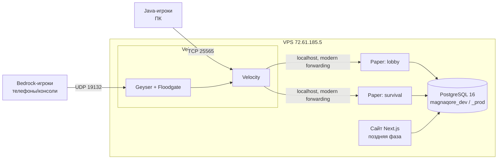

# Архитектура MagnaQore

## Общая схема

Одна точка входа — Velocity. Backend-серверы Paper слушают только `127.0.0.1` и принимают игроков только от proxy (modern forwarding + секрет). Bedrock-игроки заходят через Geyser (транслятор протокола) + Floodgate (аутентификация Xbox без Java-аккаунта).

> **Этапность**: на запуске работает только `survival` (по итогам ресёрча — см. RESEARCH.md); `lobby` и другие режимы подключаются к сети позже, когда онлайн их прокормит. Схема выше — целевая.

## Компоненты

| Компонент | Роль | Хранилище |
|---|---|---|
| Velocity | proxy, маршрутизация между режимами, вход в сеть | — |
| Geyser + Floodgate | кроссплей Bedrock → Java | — |
| Плагин авторизации | регистрация/логин offline-игроков, premium auto-login | PostgreSQL |
| Paper `lobby` | хаб: выбор режима, инфо | PostgreSQL (общие плагины) |
| Paper `survival` | основной режим: выживание | PostgreSQL |
| LuckPerms | права/группы во всей сети | PostgreSQL |
| PostgreSQL 16 | единая БД (авторизация, права, экономика, позже сайт) | localhost:5432 |

Точные версии всех бинарников — `infra/manifest.json` (единственный источник истины).

## Окружения

| | dev | prod |
|---|---|---|
| Velocity (Java, TCP) | 25566 | 25565 |
| Geyser (Bedrock, UDP) | 19133 | 19132 |
| Paper lobby (127.0.0.1) | 25591 | 25581 |
| Paper survival (127.0.0.1) | 25592 | 25582 |
| БД | magnaqore_dev | magnaqore_prod |
| Запуск | tmux (`infra/dev.sh`) | systemd (этап запуска) |
| Сайт | 3001 (dev-домен) | 3000 (prod-домен) |

RAM-бюджет (8 GB + 4 GB swap): Velocity ~0.5G, lobby ~1G, survival ~2.5G, PostgreSQL ~0.5G, ОС/прочее ~1G. Одновременно под нагрузкой держим один контур; dev поднимается на время работ.

## Безопасность

- Наружу открыты только: SSH (22), Velocity (25565/25566 TCP), Geyser (19132/19133 UDP), позже 80/443 для сайта. Firewall (ufw) включим на этапе публичного запуска — с первым правилом allow 22.
- Backend-серверы и PostgreSQL снаружи недоступны (bind 127.0.0.1).
- offline-mode компенсируется обязательной авторизацией до любых действий + forwarding-секрет (см. ADR-003).
- Секреты только в `infra/secrets/` (вне git).

## DNS (когда дойдём)

Планируемые записи (скажем пользователю на этапе запуска):
- `A`-запись `play.<домен>` → IP VPS — вход для Java (порт 25565 стандартный, SRV не нужен) и для Bedrock (порт 19132 стандартный).
- dev-вход: `A` `dev.<домен>` → тот же IP; Java-игроки на dev идут через SRV `_minecraft._tcp.dev.<домен>` → порт 25566.
- Сайт: `A` `<домен>` и `dev-web.<домен>` (или аналогичные) → IP, дальше reverse proxy по Host.

Перенос на новый VPS = смена IP в A-записях.
